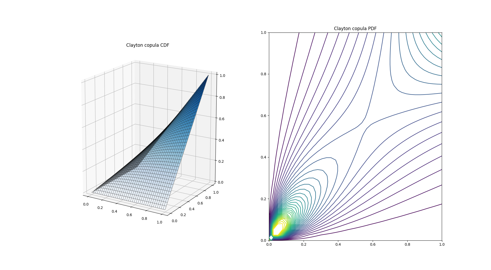
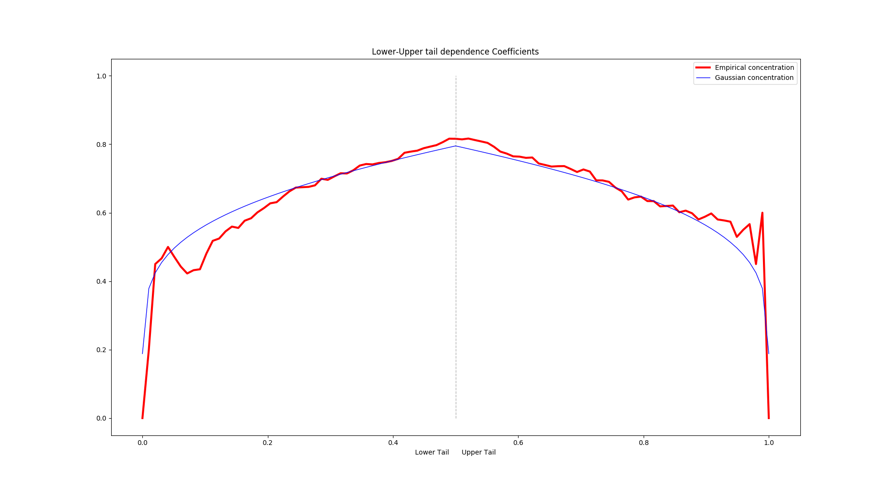
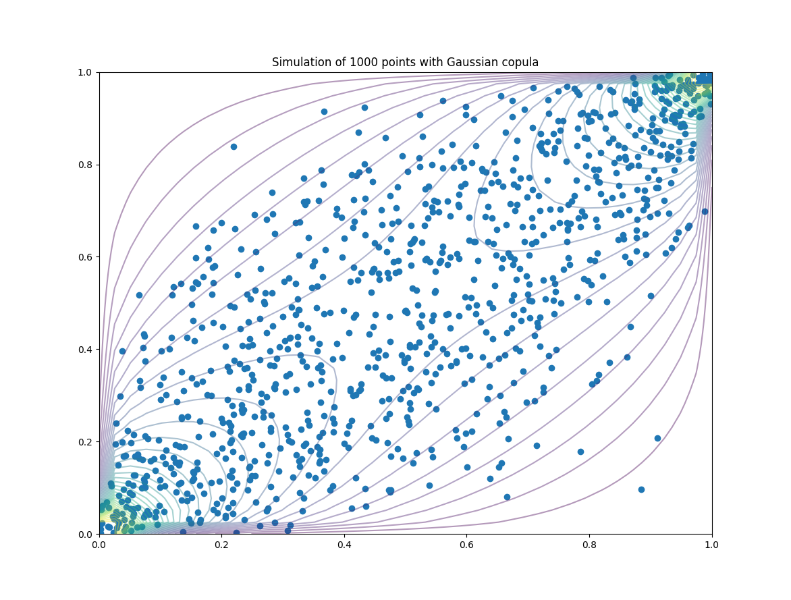

# PyCopula - Study dependencies with copulas
PyCopula is an easy-to-use Python library that allows you to study random variables dependencies with copulas. It comes with useful tools and features to plot, estimate or simulate on copulas.

* [Online Documentation](https://aipcloud.github.io/PyCopula/)

## Features

### Visualization

#### 3D PDF and CDF

#### Concentration Functions

### Estimation

### Simulation

## Development

Currently, there are only a few features implemented in the library, which are the basics components for copula handling :

- Creating Archimedean, Gaussian and Student copulas
- 3D plot of PDF and CDF
- Concentration functions and visualization
- Estimation of copulas parameters (CMLE, MLE, IFM)

In the future, I plan to release the following features :

- Goodness-of-fit
- Copula selection with criterions and statistical testing
- Examples of applications in real world with open data

